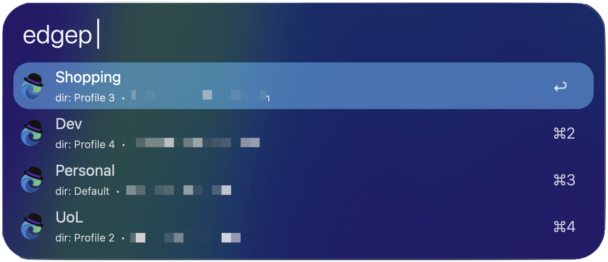
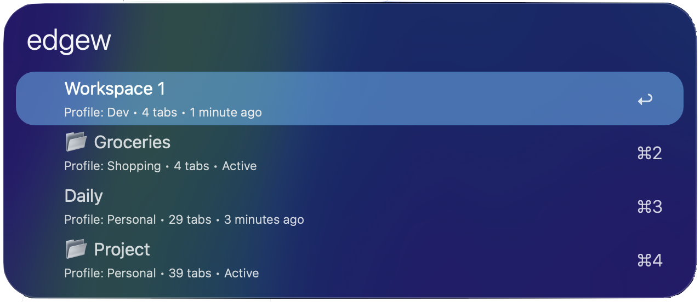
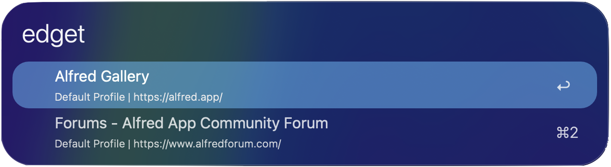

# Edge Control

Control Microsoft Edge browser directly from Alfred. Manage profiles, workspaces, and tabs with quick keyboard shortcuts.

## Usage

Search Edge profiles and open them in new windows via the `edgep` keyword.

* ↩︎ Open profile in new window
* ⌘↩︎ Copy profile directory path

Alternatively, search Edge workspaces across all profiles via the `edgew` keyword.

* ↩︎ Open workspace with associated profile
* 📂 indicates currently active workspace
* 👥 indicates shared workspace

Search all open tabs across windows and profiles via the `edget` keyword.

* ↩︎ Switch to tab
* ⌘↩︎ Copy tab URL to clipboard  
* ⌥↩︎ Close tab

## Configuration

Configure the workflow's settings in Alfred Preferences → Workflows → Edge Control → [⚙].

### User Configuration Options

* **Profile Start URL**: URL to open when launching a new profile window (default: `edge://newtab`)
* **Python Path**: Path to Python 3 executable (leave empty for system default)
* **Edge Application Path**: Path to Microsoft Edge app (useful for Beta/Canary versions)
* **Edge User Data Directory**: Custom Edge data directory location

## Setup

### System Requirements

* **macOS Big Sur (11.0) or later** - Required for Python 3.9+
* **Microsoft Edge** - Must be installed on your Mac
* **Alfred 5** with Powerpack license

### Required Permissions

When you first use this workflow, macOS will request permission for:

* **Automation Access** - Alfred needs permission to control Microsoft Edge
  * You'll see: "Alfred wants access to control Microsoft Edge"
  * Click "OK" to grant permission
  * If you accidentally deny, go to System Settings → Privacy & Security → Automation → Alfred → Enable Microsoft Edge

### Python Requirements

This workflow requires Python 3.9 or later, which is included in macOS Big Sur and later. No additional packages need to be installed.

### Microsoft Edge

Microsoft Edge must be installed on your Mac. The workflow will automatically detect the standard installation location. For Beta or Canary versions, configure the Edge Application Path in the workflow settings.

## Features

### Profile Management
* View all Edge profiles with avatars
* Search by profile name, email, or directory
* Open profiles in new windows with configurable start URL

### Workspace Management  
* Search workspaces across all profiles
* View workspace details (tab count, last active time)
* Real-time active workspace detection
* Visual indicators for active and shared workspaces

### Tab Management
* Search all open tabs across windows
* Quick switch to any tab
* Copy URLs or close tabs with modifier keys
* See profile and workspace associations

## Troubleshooting

### Edge Not Found
* Ensure Microsoft Edge is installed
* For non-standard installations, configure the Edge Application Path

### No Profiles/Workspaces Listed
* Check that Edge has been opened at least once
* Verify the Edge User Data Directory setting if using a custom location

### Python Errors
* Ensure Python 3.9+ is available
* Configure Python Path if using a non-system Python installation

## Privacy & Security

This workflow:
* Only reads Edge configuration files (no modifications)
* Does not store or transmit any user data
* Does not access browsing history or passwords
* Requires no network access

## Support

* Report issues: [GitHub Issues](https://github.com/jiywww/edge-alfred-workflow/issues)
* Latest version: [GitHub Releases](https://github.com/jiywww/edge-alfred-workflow/releases)

## License

MIT License - See [LICENSE](LICENSE) file for details.